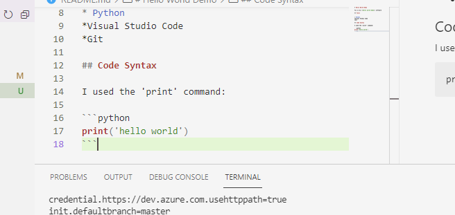

# Hello World Demo

This is my **hello world demo** software

## Tools


* Python
*Visual Studio Code
*Git

## Code Syntax

I used the 'print' command:

```python
print('hello world')
```

## Link to a video demonstration
https://vimeo.com/607526332/9bd3a26116


